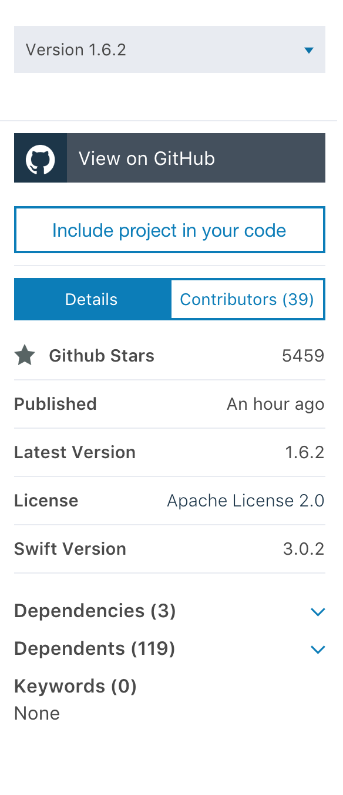
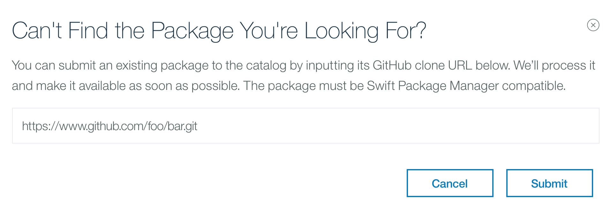
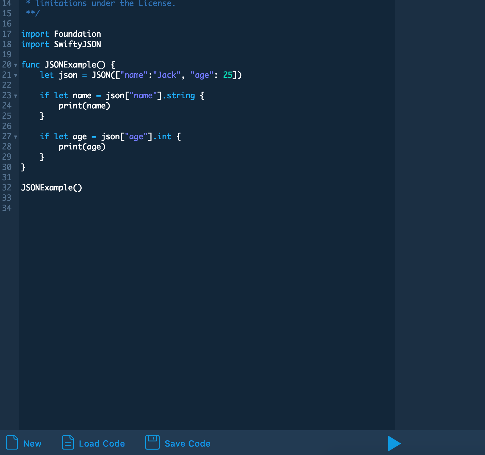
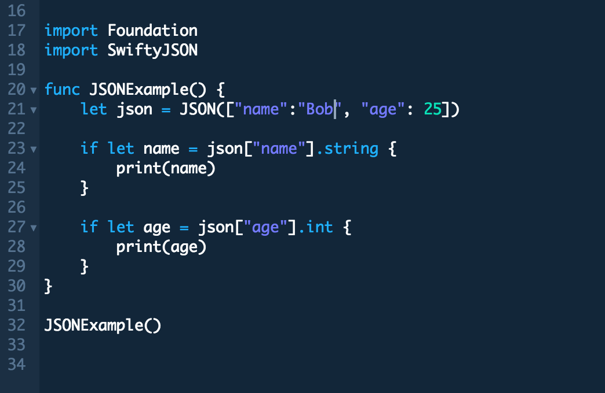
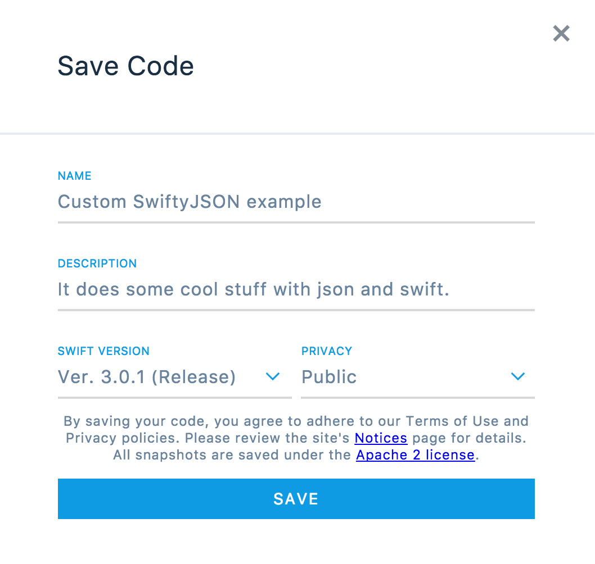
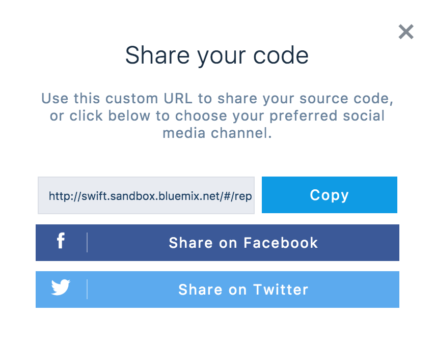

# swift-sandbox

Learn how to utilize the [IBM Swift Package Catalog](https://packagecatalog.com)
and the [IBM Swift Sandbox](https://swift.sandbox.bluemix.net) to accelerate your
Swift development with ease.


## Outline

This tutorial takes less than 5 minutes to complete!

[Section 1: IBM Swift Package Catalog](#section-1-ibm-swift-package-catalog)
1. [Search for packages](#search-for-packages)
2. [View package dependents](#view-package-dependents)
3. [Submit a package](#submit-a-package)

[Section 2: IBM Swift Sandbox](#section-2-ibm-swift-sandbox)
1. [Try out a sample](#try-out-a-sample)
2. [Create a snippet](#create-a-snippet)
3. [Share your snippet](#share-your-snippet)

## Section 1: IBM Swift Package Catalog

In this section you will become familiar with the main features of the IBM Swift
Package Catalog, and how they can augment your Swift development experience.

### Search for packages

Searching for community Swift packages is one of the main value adds provided
by the IBM Swift Package Catalog. Swift packages are mildly categorized, but
we support fuzzy search on packages as well.

Please open [Swift Package Catalog](https://packagecatalog.com) in a new tab.

In the search bar on the landing page, enter a package or category you are
looking for:

> Hint: If you aren't sure what you are looking for, try `json`.


> Note: After filling in the search bar, hitting `Enter` or clicking
> `See All Results for "json"`  will bring you to a comprehensive search page
> with more results.

#### Checkpoint

Search for, navigate to, and view the READMEs for each of the following packages:
- IBM-Swift/Kitura

### View package dependents

Being able to easily view the Swift packages that depend on a specific Swift package
gives some valuable insight into the community view of that package. This is
easy to view with the IBM Swift Package Catalog.

While viewing the READMEs from the previous [Checkpoint](#checkpoint-1), off to
the right there is a panel of information about each of the packages:



By arrowing down on the `Dependents` field for each, you can view the dependents.
Likewise, if you are interested in the `Dependencies` of a given package.

#### Checkpoint

View the dependents and dependencies for the following packages:
- IBM-Swift/Kitura

### Submit a package

We try our best to populate our Swift package index on a regular basis as new
packages are released, but we are only humans. If you know about Swift packages
that you can't find while searching the IBM Swift Package Catalog then please
help us out. Its easy, all you need is a public GitHub repo.

From any page in the catalog, click the `Submit a Package` in the navigation bar.


Then simply submit the url associated with the package's GitHub repository.



> Note: It can take a few moments before our backend processes your submission.
> If you don't see the package appear in the catalog within an hour, something
> likely didn't work. Check that the url you submitted is accurate, and the
> repository is public.

## Section 2: IBM Swift Sandbox

In this section we build on the Swift Package Catalog experience and discover
the IBM Swift Sandbox environment where you can try out Swift server samples,
or craft entirely new snippets of Swift code rapidly, in a safe environment.

### Try out a sample

Back in your Swift Package Catalog browser tab, either navigate to the
IBM-Swift/SwiftyJSON package or just click here
[SwiftyJSON](https://packagecatalog.com/package/IBM-Swift/SwiftyJSON)

You will notice that this particular package has a new button near the
`View on GitHub` button that looks like this:


When a Swift package in the Swift Package Catalog has this button it means the
package owner has provided samples to try out the package code in the Swift
Sandbox. Go ahead and click `Try in Sandbox` for IBM-Swift/SwiftyJSON and
select one of the registered samples that appear:


Once you are redirected to the IBM Swift Sandbox, run the sample as is
by clicking the play button in the bottom middle of the screen:



The result is output in the right hand side panel.

#### Checkpoint

Did the sample run successfully? It should have output:
```
Jack
25
```

### Create a snippet

In the interest of time, simply change the json `name` value to be `Bob`
instead of `Jack`:



> Bonus: If you are feeling brave, ditch the sample and create your own snippet.
> It just has to run within 5 seconds, and no network activity.

#### Checkpoint

Run the modified sample (now your custom snippet) to see the changed result.
It should now output:
```
Bob
25
```

### Share your snippet

Now that you have made some custom snippet on the IBM Swift Sandbox, you should
probably share it with the world. We make sharing your snippet, easy!

Click the `Save Code` button on the bottom navigation bar:


Fill in the form:



After clicking `Save` you will have the option to share via link or social media:



#### Checkpoint

Send your code snippet link to a friend.
