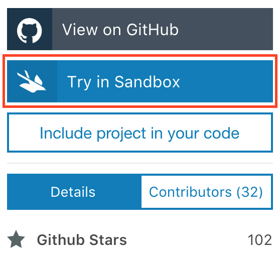

# swift-sandbox

Learn how to utilize the [IBM Swift Package Catalog](https://packagecatalog.com)
and the [IBM Swift Sandbox](https://swift.sandbox.bluemix.net) to accelerate your
Swift development with ease.

## Outline

Sections 1 and 2 take less than 5 minutes to complete!

Section 3 is recommended to get the full experience, if time allows. You can
always come back later.

[Section 1: IBM Swift Package Catalog](#section-1-ibm-swift-package-catalog)
1. [Search for packages](#search-for-packages)
2. [Submit a package](#submit-a-package)
3. [View package dependents](#view-package-dependents)

[Section 2: IBM Swift Sandbox](#section-2-ibm-swift-sandbox)
1. [Try out a sample](#try-out-a-sample)
2. [Create a snippet](#create-a-snippet)
3. [Share your snippet](#share-your-snippet)

[Section 3: Exercises](#section-3-exercises)
- [Login or sign up](#login-or-sign-up)
- [Favorite a package](#favorite-a-package)
- [Author a snippet](#author-a-snippet)

## Section 1: IBM Swift Package Catalog

In this section you will become familiar with the main features of the IBM Swift
Package Catalog, and how they can augment your Swift development experience.

### Search for packages

Please navigate to [Swift Package Catalog](https://packagecatalog.com) in a
browser.

In the search bar that is on the landing page, enter a package or a category
you are looking for:

> Hint: If you aren't sure what you are looking for, try `json`

> Note: After filling in the search bar, hitting `Enter` or clicking
> `See All Results for "json"`  will bring you to a comprehensive search page
> with more results.

### Submit a package

TODO

### View package dependents

TODO

## Section 2: IBM Swift Sandbox

In this section we build on the Swift Package Catalog experience and discover
the IBM Swift Sandbox environment where you can try out Swift server samples,
or craft entirely new snippets of Swift code rapidly, in a safe environment.

### Try out a sample

Back in your Swift Package Catalog browser tab either navigate to the
IBM-Swift/SwiftyJSON package, or just click here
[SwiftyJSON](https://packagecatalog.com/package/IBM-Swift/SwiftyJSON)

You will notice that this particular package has a new button near the
`View on GitHub` button that looks like this:

When a Swift package in the Swift Package Catalog has this button it means the
package owner has provided samples to try out the package code in the Swift
Sandbox. Go ahead and click `Try in Sandbox` for IBM-Swift/SwiftyJSON and
select one of the registered samples that appear:

 TODO: Steps for executing the sample as is.

### Create a snippet

TODO: Steps for making a simple yet noticeable change to the sample.

### Share your snippet

TODO: Steps for sharing the modified sample.

## Section 3: Exercises

### Login or sign up

If you would like to keep a list of your favorite Swift packages,
or subscribe to notifications for particular packages, go ahead and
`Login/Sign Up` so that the catalog can persist your favorites and
subscriptions when you click the heart next to a package for example.

TODO: Add screen shots.

### Favorite a package

TODO: Steps for adding a package to a user's favorites.

### Author a snippet

TODO: Steps for authoring a snippet

## Troubleshooting

TODO: Common issues and how to fix/work around them.
